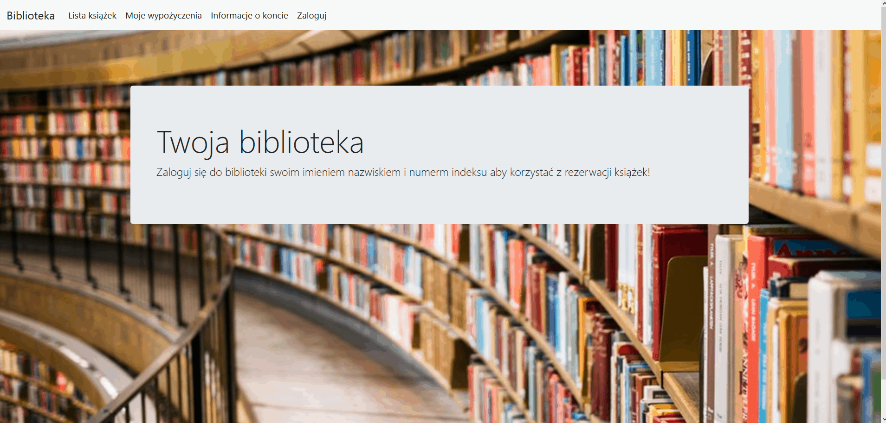

# Project Name
> Library reservation system

## Table of contents
* [General info](#general-info)
* [Screenshots](#screenshots)
* [Technologies](#technologies)
* [Setup](#setup)

## General info
Web app for making book reservation.

## Screenshots

## Technologies
* Java EE
* mySQL

## Setup
To run this project open it in Eclipse. To host it locally install tomcat server and add the project to it.